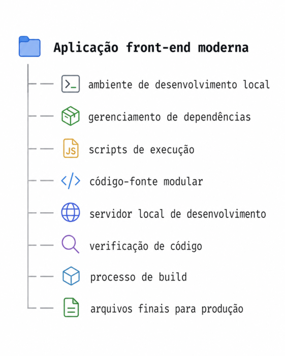
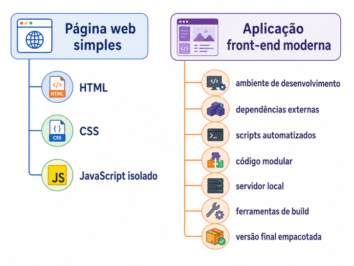

## Aplicação front-end moderna

Uma **aplicação front-end moderna** é uma aplicação web construída com apoio de ferramentas que organizam o desenvolvimento, a execução local e a geração da versão final para publicação. Nesse modelo, a interface não é desenvolvida apenas como arquivos HTML, CSS e JavaScript isolados, mas como um projeto estruturado, com dependências, scripts, módulos e processo de build.

A documentação oficial do React recomenda o uso de uma ferramenta de build para criar aplicações React do zero. Essas ferramentas oferecem recursos para executar o código-fonte, disponibilizar um servidor de desenvolvimento local e gerar uma versão preparada para implantação. ([react.dev](https://react.dev/learn/build-a-react-app-from-scratch))

O Vite se enquadra nesse modelo ao fornecer um servidor de desenvolvimento e um comando de build para produção. ([vite.dev](https://vite.dev/guide/))

Uma aplicação front-end moderna normalmente envolve os seguintes elementos técnicos:



O **ambiente de desenvolvimento local** permite executar ferramentas no computador do desenvolvedor. No ecossistema JavaScript, esse ambiente é sustentado por recursos como Node.js e npm.

O **gerenciamento de dependências** permite instalar e registrar bibliotecas externas utilizadas pelo projeto. Essas dependências ficam declaradas no `package.json` e são instaladas por meio do npm.

Os **scripts de execução** centralizam comandos recorrentes do projeto, como desenvolvimento local, build e preview. Esses scripts também são definidos no `package.json`.

Exemplo simplificado:

```json
{
  "scripts": {
    "dev": "vite",
    "build": "tsc -b && vite build",
    "preview": "vite preview"
  }
}
```

O **código-fonte modular** permite dividir o projeto em arquivos com finalidades específicas. Essa organização favorece manutenção, reutilização e separação de responsabilidades.

O **servidor local de desenvolvimento** disponibiliza a aplicação no navegador durante a implementação. Ele permite visualizar alterações, testar comportamentos e validar a interface em tempo de desenvolvimento.

O **processo de build** transforma o código-fonte em arquivos finais otimizados para publicação. Em projetos Vite, esse resultado costuma ser gerado em um diretório de saída, como `dist`.

A distinção entre uma página web simples e uma aplicação front-end moderna pode ser representada assim:



Assim, uma aplicação front-end moderna deve ser compreendida como um projeto web estruturado por ferramentas. O navegador continua sendo o ambiente de execução da interface, mas o desenvolvimento passa a depender de uma cadeia técnica formada por ambiente local, gerenciador de pacotes, scripts, servidor de desenvolvimento e build de produção.

## SPA — Single Page Application

Uma **SPA — Single Page Application** é uma aplicação web estruturada para carregar um documento HTML principal e atualizar a interface dinamicamente no navegador conforme a interação do usuário. Nesse modelo, a navegação entre telas lógicas da aplicação não exige, necessariamente, o carregamento completo de uma nova página HTML a cada mudança de seção.

Em uma aplicação multipágina tradicional, cada navegação tende a solicitar ao servidor um novo documento HTML completo. Em uma SPA, a aplicação já carregada no navegador interpreta a mudança de rota e renderiza a interface correspondente.

Em uma SPA, o arquivo HTML principal funciona como base de montagem da aplicação. A partir dele, o JavaScript carregado no navegador assume a responsabilidade de controlar a interface, responder às interações e renderizar os componentes correspondentes ao estado ou à rota atual.

O conceito de SPA não significa que a aplicação tenha apenas uma tela. Significa que ela possui um documento HTML principal e que as mudanças de tela são tratadas dinamicamente pela aplicação no navegador.

## Projeto React com TypeScript

Um **projeto React com TypeScript** combina a construção de interfaces baseada em componentes com a verificação estática de tipos. Nesse modelo, o React organiza a interface da aplicação, enquanto o TypeScript descreve contratos de dados, propriedades, funções e estados utilizados no código.

A documentação oficial do React apresenta a biblioteca como uma forma de criar interfaces de usuário a partir de componentes. Esses componentes podem representar partes pequenas da interface ou estruturas maiores da aplicação. ([react.dev](https://react.dev/learn))

A documentação oficial do TypeScript define a linguagem como JavaScript com sintaxe para tipos. Essa camada de tipagem permite identificar inconsistências durante o desenvolvimento, antes da execução do código no navegador. ([typescriptlang.org](https://www.typescriptlang.org/))

Em projetos criados com o template `react-ts`, os arquivos de componentes normalmente utilizam a extensão `.tsx`. Essa extensão indica que o arquivo combina **TypeScript** com **JSX**, permitindo escrever estruturas de interface dentro de um arquivo TypeScript.

Exemplo simplificado:

```tsx
type PageTitleProps = {
  title: string;
  subtitle: string;
};

export function PageTitle({ title, subtitle }: PageTitleProps) {
  return (
    <header>
      <h1>{title}</h1>
      <p>{subtitle}</p>
    </header>
  );
}
```

Nesse exemplo, `PageTitleProps` define o formato esperado das propriedades recebidas pelo componente. A propriedade `title` deve ser uma string, assim como `subtitle`. Caso o componente seja utilizado com dados incompatíveis, o TypeScript pode indicar o erro durante o desenvolvimento.

O uso de TypeScript em componentes React torna explícitos os contratos internos da aplicação. Esses contratos reduzem ambiguidades sobre quais dados um componente recebe, quais valores uma função manipula e quais estruturas são esperadas em objetos, listas e estados.

A aplicação final continua sendo executada como JavaScript no navegador. O TypeScript atua durante o desenvolvimento e no processo de compilação, permitindo que o código seja verificado antes da geração da versão executável.

