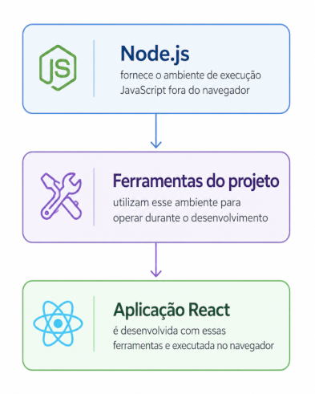

## Node.js

O **Node.js** é o ambiente de execução utilizado como base para o desenvolvimento de aplicações JavaScript modernas fora do navegador. Em projetos React criados com Vite, ele fornece a infraestrutura necessária para executar ferramentas de criação, instalação, desenvolvimento, testes e empacotamento da aplicação.

De acordo com a documentação oficial, o Node.js é um ambiente de execução JavaScript gratuito, open-source e multiplataforma, usado para criar servidores, aplicações web, ferramentas de linha de comando e scripts. Sua função central é permitir que código JavaScript seja executado fora do navegador. ([nodejs.org](https://nodejs.org/en))

Mesmo que a aplicação final seja executada no navegador, o processo de desenvolvimento depende de ferramentas que operam localmente no sistema operacional. Essas ferramentas utilizam o Node.js para executar comandos, processar arquivos, instalar pacotes, iniciar servidores locais e gerar versões de produção.

A relação pode ser representada da seguinte forma:



No contexto de uma aplicação React com Vite, o Node.js não corresponde a uma tela, componente visual ou regra de negócio. Sua função está no nível do ambiente de desenvolvimento. Ele antecede o uso do npm, do Vite, do React e do TypeScript, pois esses recursos dependem de um ambiente capaz de executar ferramentas JavaScript localmente.

A instalação pode ser verificada no terminal com o comando:

```bash
node -v
```

Esse comando retorna a versão instalada do Node.js. Caso o comando não seja reconhecido pelo sistema, o ambiente ainda não está preparado para iniciar a criação e execução do projeto.
