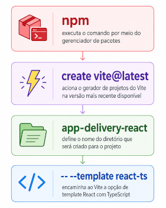
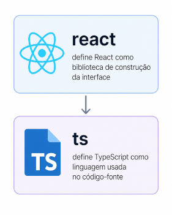
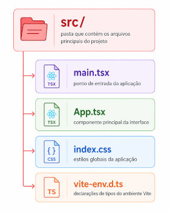
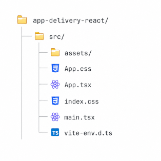
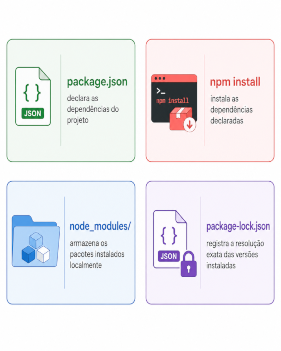
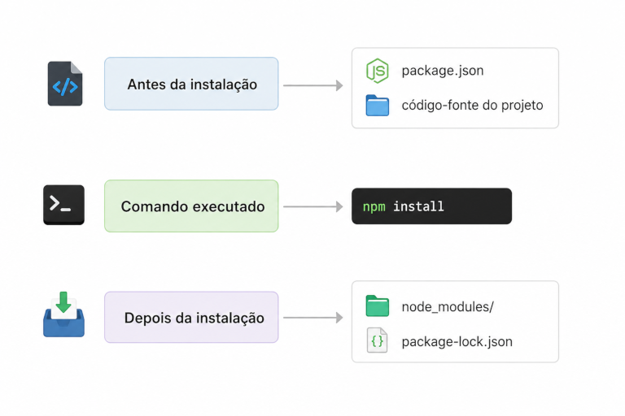

## Criação do projeto com Vite

A criação do projeto com **Vite** corresponde à etapa de geração da estrutura inicial da aplicação front-end. Após a instalação do Node.js e a disponibilidade do npm, o projeto pode ser criado por meio do comando oficial indicado na documentação do Vite.

O Vite é uma ferramenta de desenvolvimento e build para aplicações web modernas. Sua função é fornecer uma estrutura inicial de projeto, um servidor de desenvolvimento local e recursos de empacotamento para produção. A documentação oficial apresenta o comando `npm create vite@latest` como uma das formas recomendadas para iniciar um novo projeto. ([vite.dev](https://vite.dev/guide/))

O comando para criar o projeto é:

```bash
npm create vite@latest app-delivery-react -- --template react-ts
```

A estrutura do comando é composta pelos seguintes elementos:



O primeiro `--` separa os argumentos interpretados pelo npm dos argumentos encaminhados ao gerador do Vite. O trecho `--template react-ts` especifica que o projeto deve ser criado com o template React associado ao TypeScript.

Após a execução do comando, o Vite cria um diretório com arquivos iniciais de configuração, arquivos de entrada da aplicação, dependências declaradas e estrutura básica de código-fonte. Essa estrutura será detalhada no subtítulo seguinte.

### Template `react-ts`

O template **`react-ts`** é a predefinição utilizada pelo Vite para criar um projeto configurado com **React** e **TypeScript**. Ao informar esse template no comando de criação, o Vite gera uma estrutura inicial adequada para o desenvolvimento de componentes React em arquivos `.tsx`, com suporte à verificação de tipos fornecida pelo TypeScript.

A documentação oficial do Vite apresenta o `create-vite` como uma ferramenta para iniciar projetos a partir de templates básicos para diferentes frameworks, incluindo React com TypeScript. ([vite.dev](https://vite.dev/guide/))

O template é especificado no comando por meio do trecho:

```bash
-- --template react-ts
```

No comando completo:

```bash
npm create vite@latest app-delivery-react -- --template react-ts
```

A expressão `react-ts` combina duas decisões técnicas:



A escolha do template `react-ts` altera a estrutura inicial do projeto em relação a um template JavaScript puro. O código-fonte passa a usar arquivos com extensão `.ts` e `.tsx`, e o projeto recebe configuração própria para compilação e verificação de tipos.

Uma estrutura inicial típica gerada com esse template inclui arquivos como:



O arquivo `main.tsx` contém o ponto de entrada da aplicação React. O arquivo `App.tsx` representa o componente inicial gerado pelo template. O arquivo `index.css` concentra estilos globais. O arquivo `vite-env.d.ts` fornece declarações de tipos específicas do ambiente Vite.

A extensão `.tsx` indica que o arquivo combina TypeScript com JSX. Essa combinação permite escrever componentes React com marcação de interface e, ao mesmo tempo, utilizar recursos de tipagem estática.

### Estrutura inicial gerada pelo Vite

A estrutura inicial gerada pelo **Vite** corresponde ao conjunto mínimo de arquivos e diretórios necessários para iniciar uma aplicação front-end. Essa estrutura depende do template selecionado no momento da criação do projeto. No caso do template `react-ts`, o Vite cria uma base preparada para React, TypeScript, JSX/TSX, CSS e execução em ambiente local.

A documentação oficial do Vite apresenta o comando `npm create vite@latest` como forma de geração inicial do projeto e lista o template `react-ts` entre os modelos disponíveis. ([vite.dev](https://vite.dev/guide/))

Uma estrutura inicial típica do template `react-ts` pode ser representada assim:


O arquivo `index.html` é o documento HTML principal da aplicação. Em uma aplicação React criada com Vite, esse arquivo contém o elemento de montagem da aplicação e o carregamento do ponto de entrada TypeScript.

```html
<div id="root"></div>
<script type="module" src="/src/main.tsx"></script>
```

O elemento `<div id="root"></div>` define o local em que a aplicação React será renderizada. O script com `type="module"` aponta para o arquivo `src/main.tsx`, responsável por iniciar a aplicação.

O diretório `src` concentra o código-fonte da aplicação:



O arquivo `src/main.tsx` é o ponto de entrada da aplicação React. O arquivo `src/App.tsx` contém o componente inicial gerado pelo template. O arquivo `src/index.css` concentra estilos globais. O arquivo `src/App.css` contém estilos associados ao componente inicial. O diretório `src/assets` armazena recursos importados pelo código-fonte, como imagens e ícones. O arquivo `src/vite-env.d.ts` contém declarações de tipos específicas do ambiente Vite.

O diretório `public` é reservado para arquivos estáticos servidos diretamente pela aplicação. Recursos colocados nesse diretório são disponibilizados sem necessidade de importação pelo código-fonte.

O arquivo `package.json` registra metadados, dependências, dependências de desenvolvimento e scripts do projeto.

```json
{
  "scripts": {
    "dev": "vite",
    "build": "tsc -b && vite build",
    "preview": "vite preview"
  },
  "dependencies": {
    "react": "...",
    "react-dom": "..."
  },
  "devDependencies": {
    "@vitejs/plugin-react": "...",
    "typescript": "...",
    "vite": "..."
  }
}
```

O arquivo `package-lock.json` registra a resolução exata das versões instaladas das dependências. Sua função é preservar a consistência da instalação entre diferentes ambientes.

O arquivo `tsconfig.json` indica a raiz de configuração TypeScript do projeto. Segundo a documentação oficial do TypeScript, a presença de um `tsconfig.json` indica que o diretório é a raiz de um projeto TypeScript e define opções do compilador. ([typescriptlang.org](https://www.typescriptlang.org/docs/handbook/tsconfig-json.html))

Em projetos Vite com TypeScript, o `tsconfig.json` pode atuar como arquivo agregador:

```json
{
  "files": [],
  "references": [
    { "path": "./tsconfig.app.json" },
    { "path": "./tsconfig.node.json" }
  ]
}
```

O arquivo `tsconfig.app.json` concentra as configurações TypeScript aplicadas ao código da aplicação. Ele define como arquivos `.ts` e `.tsx` dentro de `src` são interpretados e verificados.

```json
{
  "compilerOptions": {
    "jsx": "react-jsx",
    "strict": true
  },
  "include": ["src"]
}
```

O arquivo `tsconfig.node.json` concentra configurações TypeScript aplicadas a arquivos executados no ambiente Node.js, como arquivos de configuração do próprio Vite.

```json
{
  "compilerOptions": {
    "composite": true,
    "module": "ESNext"
  },
  "include": ["vite.config.ts"]
}
```

O arquivo `vite.config.ts` contém a configuração do Vite. Em um projeto React, ele normalmente registra o plugin oficial do React para Vite.

```ts
import { defineConfig } from "vite";
import react from "@vitejs/plugin-react";

export default defineConfig({
  plugins: [react()],
});
```

### Instalação de dependências

A **instalação de dependências** corresponde à etapa em que os pacotes declarados no projeto são baixados e preparados para uso local. Em um projeto criado com Vite, essa etapa ocorre após a geração da estrutura inicial e antes da execução da aplicação em modo de desenvolvimento.

O comando utilizado é:

```bash
npm install
```

O comando `npm install` lê o arquivo `package.json`, identifica as dependências declaradas e instala os pacotes necessários no diretório `node_modules`. A documentação oficial do Node.js descreve que, quando um projeto possui um arquivo `package.json`, a execução de `npm install` instala tudo o que o projeto necessita, criando a pasta `node_modules` quando ela ainda não existe. ([nodejs.org](https://nodejs.org/en/learn/getting-started/an-introduction-to-the-npm-package-manager))

A relação entre os arquivos envolvidos pode ser representada da seguinte forma:



O arquivo `package.json` é a referência inicial para a instalação. Nele são declarados os pacotes necessários à aplicação e às ferramentas de desenvolvimento. Esses pacotes costumam ser organizados em duas seções principais: `dependencies` e `devDependencies`.

A seção `dependencies` reúne pacotes necessários para a aplicação funcionar.

```json
{
  "dependencies": {
    "react": "...",
    "react-dom": "..."
  }
}
```

A seção `devDependencies` reúne pacotes necessários ao processo de desenvolvimento, verificação, compilação, testes ou empacotamento.

```json
{
  "devDependencies": {
    "vite": "...",
    "typescript": "...",
    "@vitejs/plugin-react": "..."
  }
}
```

A pasta `node_modules` armazena fisicamente os pacotes instalados. Essa pasta é gerada automaticamente pelo npm e contém dependências diretas e transitivas, isto é, pacotes exigidos por outros pacotes.

Em projetos versionados com Git, a pasta `node_modules` normalmente não é enviada ao repositório. O padrão é versionar `package.json` e `package-lock.json`, permitindo que outro ambiente reinstale as dependências por meio do mesmo comando:

```bash
npm install
```

A instalação de dependências pode ser sintetizada assim:


