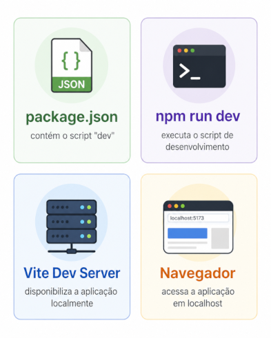
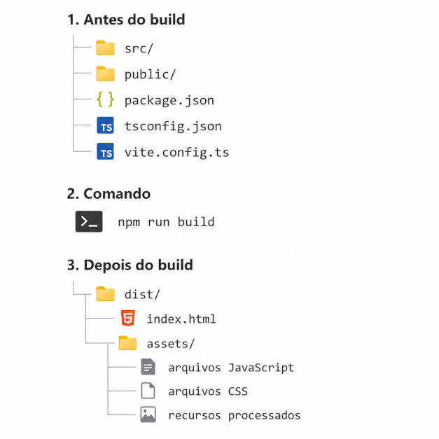

## Execução em modo desenvolvimento

A **execução em modo desenvolvimento** corresponde à etapa em que a aplicação é iniciada localmente para implementação, teste visual e verificação contínua durante a construção do projeto. Em projetos criados com Vite, essa execução é realizada por meio de um script definido no arquivo `package.json`.

O comando utilizado é:

```bash
npm run dev
```

Esse comando aciona o script `dev` declarado no `package.json`. Em um projeto Vite, esse script normalmente executa o comando `vite`.

Exemplo simplificado:

```json
{
  "scripts": {
    "dev": "vite"
  }
}
```

A documentação oficial do Vite apresenta `npm run dev` como o comando usado para iniciar o servidor de desenvolvimento após a criação e a instalação das dependências do projeto. Esse servidor permite executar a aplicação localmente durante a fase de desenvolvimento. ([vite.dev](https://vite.dev/guide/))

Durante a execução em modo desenvolvimento, o Vite disponibiliza a aplicação em um endereço acessível pelo navegador, normalmente semelhante a:

```txt
http://localhost:5173/
```

O endereço pode variar conforme a configuração do projeto ou a disponibilidade da porta. O termo `localhost` indica que a aplicação está sendo servida no próprio computador do desenvolvedor. A porta, como `5173`, identifica o canal local usado pelo servidor de desenvolvimento.

A execução em modo desenvolvimento não gera a versão final da aplicação. Ela mantém o projeto em um estado adequado para edição, recarregamento e verificação contínua. Nessa etapa, os arquivos-fonte permanecem no ambiente de desenvolvimento, e o Vite atua como intermediário entre o código escrito e a visualização no navegador.

Uma característica relevante do ambiente de desenvolvimento do Vite é o suporte a atualizações rápidas durante a edição do código. A documentação oficial destaca o uso de Hot Module Replacement, recurso que permite atualizar módulos modificados sem recarregar completamente a página quando possível. ([vite.dev](https://vite.dev/guide/features.html#hot-module-replacement))

A execução em modo desenvolvimento pode ser sintetizada assim:




## Servidor local de desenvolvimento

O **servidor local de desenvolvimento** é o processo responsável por disponibilizar a aplicação no navegador durante a fase de implementação. Em projetos criados com Vite, esse servidor é iniciado pelo comando de desenvolvimento e executado no próprio computador do desenvolvedor.

A documentação oficial do Vite define a ferramenta como composta por duas partes principais: um servidor de desenvolvimento com recursos voltados ao desenvolvimento moderno, como Hot Module Replacement, e um comando de build responsável por empacotar o código para produção. ([vite.dev](https://vite.dev/guide/))

Após a execução do comando:

```bash
npm run dev
```

o Vite inicia um servidor local e informa no terminal um endereço de acesso semelhante a:

```txt
Local:   http://localhost:5173/
```

O termo `localhost` indica que a aplicação está sendo servida no próprio computador. A porta, como `5173`, identifica o canal utilizado pelo servidor para disponibilizar a aplicação no navegador. Caso essa porta esteja ocupada, o Vite pode utilizar outra porta disponível.

O servidor local de desenvolvimento não corresponde à versão final da aplicação. Sua função é fornecer um ambiente adequado para edição, visualização e validação contínua do código durante a implementação.

Nesse ambiente, o Vite processa os módulos da aplicação conforme necessário e permite que alterações no código sejam refletidas rapidamente no navegador. Esse comportamento reduz o intervalo entre modificar um arquivo e verificar o resultado visual ou funcional da alteração.

## Build da aplicação

O **build da aplicação** corresponde ao processo de geração da versão final do projeto para distribuição ou publicação. Diferentemente da execução em modo desenvolvimento, o build não mantém o projeto em estado de edição contínua. Sua finalidade é produzir arquivos otimizados para execução em ambiente de produção.

Em projetos criados com Vite, o build normalmente é executado pelo comando:

```bash
npm run build
```

Esse comando aciona o script `build` definido no arquivo `package.json`.

Exemplo simplificado:

```json
{
  "scripts": {
    "build": "tsc -b && vite build"
  }
}
```

A documentação oficial do Vite apresenta `vite build` como o comando responsável por construir a aplicação para produção. Por padrão, o resultado do build é gerado no diretório `dist`. ([vite.dev](https://vite.dev/guide/build))

A etapa `tsc -b` está relacionada ao TypeScript. O comando `tsc` executa o compilador TypeScript, enquanto a opção `-b` utiliza o modo de build com base nas configurações do projeto.

O resultado do build é uma pasta com arquivos estáticos prontos para implantação. Em geral, essa pasta contém HTML, JavaScript, CSS e recursos processados.




Durante o build, o Vite processa os módulos importados, resolve dependências, aplica transformações necessárias e gera uma versão otimizada da aplicação. Essa versão é distinta do ambiente de desenvolvimento, pois é preparada para carregamento eficiente no navegador.

A pasta `dist` não corresponde ao código-fonte original. Ela contém o resultado processado do projeto. Por esse motivo, em muitos projetos versionados com Git, `dist` pode ser tratada como artefato de build, enquanto o código-fonte permanece concentrado em diretórios como `src`.

## Preview da aplicação empacotada

O **preview da aplicação empacotada** corresponde à execução local da versão gerada pelo processo de build. Essa etapa permite verificar, no navegador, o comportamento da aplicação após a geração dos arquivos finais destinados ao ambiente de produção.

Em projetos criados com Vite, o preview normalmente é executado pelo comando:

```bash
npm run preview
```

Esse comando aciona o script `preview` definido no arquivo `package.json`.

Exemplo simplificado:

```json
{
  "scripts": {
    "preview": "vite preview"
  }
}
```

A documentação oficial do Vite apresenta o comando `vite preview` como uma forma de iniciar localmente um servidor estático para servir os arquivos presentes no diretório de build. Esse comando deve ser usado após a execução de `vite build`, pois não substitui o processo de build nem executa a aplicação diretamente a partir dos arquivos-fonte. ([vite.dev](https://vite.dev/guide/cli.html#vite-preview))

A sequência usual é:

```bash
npm run build
npm run preview
```

O primeiro comando gera a versão final da aplicação. O segundo disponibiliza localmente essa versão empacotada para inspeção.

O preview não deve ser confundido com o modo de desenvolvimento. No modo de desenvolvimento, o Vite trabalha diretamente com os arquivos-fonte e oferece recursos voltados à edição contínua. No preview, a aplicação servida corresponde ao resultado previamente construído pelo build.