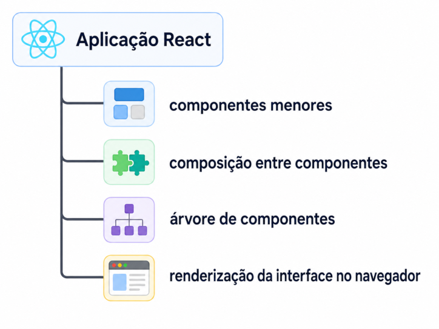

## React

O **React** é a biblioteca utilizada para construir interfaces de usuário a partir de componentes. Em uma aplicação React, a interface não é organizada como um único bloco de HTML, mas como um conjunto de partes menores, reutilizáveis e combináveis.

A documentação oficial define React como uma biblioteca para construção de interfaces de usuário a partir de partes individuais chamadas componentes. Esses componentes podem ser combinados para formar telas, páginas e aplicações completas. ([react.dev](https://react.dev/))

A função principal do React é permitir que a interface seja descrita de forma **declarativa**. Isso significa que o código descreve como a interface deve aparecer em determinado estado, e o React coordena a atualização da tela quando os dados mudam.

Em React, a interface é construída por meio de componentes. Um componente pode representar uma parte pequena da tela, como um botão, ou uma estrutura maior, como uma página inteira.

Exemplo simplificado:

```tsx
function Button() {
  return <button type="button">Confirmar</button>;
}
```

Nesse exemplo, `Button` representa uma unidade de interface. A função retorna uma estrutura visual que será interpretada pelo React durante a renderização.

Componentes também podem ser combinados:

```tsx
function Header() {
  return <h1>Aplicação</h1>;
}

function App() {
  return (
    <main>
      <Header />
      <Button />
    </main>
  );
}
```

Nesse exemplo, `App` organiza a interface a partir de dois componentes: `Header` e `Button`. Essa composição permite construir interfaces maiores a partir de partes menores.

A estrutura conceitual pode ser representada assim:



O React, isoladamente, não define toda a infraestrutura de uma aplicação front-end. Ele não substitui o Vite, não gerencia pacotes, não define obrigatoriamente rotas e não impõe uma arquitetura completa de projeto. Sua função central é estruturar e atualizar a interface. Outros recursos, como roteamento, estado global, testes e empacotamento, são integrados por ferramentas e bibliotecas complementares.


## Componente React

Um **componente React** é uma unidade de organização da interface. Ele permite dividir uma aplicação em partes menores, nomeadas e combináveis, de modo que a tela não seja tratada como um único bloco visual.

A documentação oficial do React apresenta os componentes como uma das ideias centrais da biblioteca. Uma interface pode ser construída a partir de partes individuais chamadas componentes, que são combinadas para formar telas, páginas e aplicações. ([react.dev](https://react.dev/learn/your-first-component))

O conceito de componente está relacionado à decomposição da interface. Uma tela pode ser dividida em partes com responsabilidades distintas, como cabeçalho, navegação, área principal, lista, card, botão e rodapé.


Cada uma dessas partes pode ser representada por um componente. Um componente pode ter escopo reduzido, como um botão, ou escopo amplo, como uma página inteira. A definição do tamanho do componente depende da responsabilidade que ele assume dentro da aplicação.

A organização por componentes também permite composição. Um componente pode conter outros componentes, formando uma estrutura hierárquica.


Também é necessário distinguir **elementos HTML** de **componentes React**. Elementos HTML são estruturas nativas da linguagem de marcação, como `div`, `main`, `section`, `button`, `h1` e `p`. Componentes React são unidades criadas no código da aplicação para representar partes da interface.

Em JSX/TSX, essa diferença aparece na nomenclatura. Elementos HTML são escritos com letra inicial minúscula. Componentes React são escritos com letra inicial maiúscula.

```tsx
<button type="button">Confirmar</button>
```

```tsx
<Button />
```

No primeiro exemplo, `button` representa um elemento HTML nativo. No segundo, `Button` representa um componente React definido no código da aplicação.

O componente React deve ser compreendido como uma abstração de interface. Ele organiza partes da tela em unidades nomeadas, permite composição entre essas unidades e estrutura a aplicação como uma árvore de componentes. A forma específica de declarar um componente será tratada no subtítulo seguinte.

Uma forma de declarar um componente React é por meio de uma função JavaScript ou TypeScript. Essa função define uma unidade de interface e pode receber dados externos por meio de propriedades, chamadas em React de **props**.

A documentação oficial do React apresenta componentes como funções JavaScript que retornam marcação. Essa marcação descreve a parte da interface que será renderizada. ([react.dev](https://react.dev/learn/your-first-component))

A forma básica de um componente funcional é:

```tsx
function NomeDoComponente() {
  // corpo da função
}
```

Em React, o nome do componente deve iniciar com letra maiúscula. Essa convenção diferencia componentes React de elementos HTML nativos no JSX/TSX.

```tsx
function PageHeader() {
  // definição do componente
}
```

Para que o componente seja usado por outros arquivos ele deve ser exportado:

```tsx
export function PageHeader() {
  // definição do componente
}
```

Um componente também pode receber **props**. As props representam dados fornecidos ao componente no momento em que ele é utilizado.

```tsx
type PageHeaderProps = {
  title: string;
  subtitle: string;
};

export function PageHeader(props: PageHeaderProps) {
  // uso das propriedades no corpo do componente
}
```

Também é comum desestruturar as props diretamente no parâmetro da função:

```tsx
type PageHeaderProps = {
  title: string;
  subtitle: string;
};

export function PageHeader({ title, subtitle }: PageHeaderProps) {
  // uso direto de title e subtitle
}
```

Em projetos React com TypeScript, a tipagem das props torna explícito quais dados o componente espera receber. Isso reduz ambiguidades no uso do componente e permite que o TypeScript identifique chamadas incompatíveis durante o desenvolvimento.

Exemplo de uso incompatível:

```tsx
<PageHeader title="Delivery App" />
```

Nesse caso, se `subtitle` estiver definido como propriedade obrigatória em `PageHeaderProps`, o TypeScript indicará erro, pois o componente foi utilizado sem uma propriedade exigida pelo contrato.

Exemplo de uso compatível:

```tsx
<PageHeader
  title="Delivery App"
  subtitle="Pedido rápido, simples e seguro."
/>
```

O **retorno de JSX** é a parte do componente React responsável por descrever a estrutura visual que será renderizada na interface. Em componentes funcionais, essa estrutura é devolvida pela instrução `return`.

A documentação oficial do React apresenta JSX como uma extensão de sintaxe para JavaScript que permite escrever marcação semelhante a HTML dentro do código JavaScript. Essa marcação descreve a interface que o componente deve produzir. ([react.dev](https://react.dev/learn/writing-markup-with-jsx))

Exemplo básico:

```tsx
export function Button() {
  return <button type="button">Confirmar</button>;
}
```

Nesse exemplo, o componente retorna um elemento `button`. O valor retornado pelo componente é a estrutura que o React usará para compor a interface.

Quando o retorno ocupa várias linhas, utiliza-se normalmente parênteses para delimitar a estrutura JSX:

```tsx
export function PageHeader() {
  return (
    <header>
      <h1>Delivery App</h1>
      <p>Pedido rápido, simples e seguro.</p>
    </header>
  );
}
```

Os parênteses não fazem parte do JSX em si. Eles são usados para melhorar a legibilidade e evitar ambiguidades sintáticas no retorno multilinha.

Um componente deve retornar uma única estrutura externa. Essa estrutura pode conter vários elementos internos, desde que estejam agrupados por um elemento pai.

Exemplo correto:

```tsx
export function PageContent() {
  return (
    <main>
      <h1>Cardápio</h1>
      <p>Escolha os itens do pedido.</p>
    </main>
  );
}
```

Exemplo incorreto:

```tsx
export function PageContent() {
  return (
    <h1>Cardápio</h1>
    <p>Escolha os itens do pedido.</p>
  );
}
```

No exemplo incorreto, há dois elementos no mesmo nível sem um contêiner externo. Para corrigir, pode-se usar um elemento HTML, como `main`, `section` ou `div`, ou um fragmento React.

Exemplo com fragmento:

```tsx
export function PageContent() {
  return (
    <>
      <h1>Cardápio</h1>
      <p>Escolha os itens do pedido.</p>
    </>
  );
}
```

O fragmento `<>...</>` permite agrupar elementos sem criar um elemento HTML adicional no DOM.

Outro ponto importante é o cuidado com a quebra de linha após `return`. Em JavaScript, a inserção automática de ponto e vírgula pode encerrar o `return` antes do JSX.

Forma inadequada:

```tsx
export function PageHeader() {
  return
  (
    <header>
      <h1>Delivery App</h1>
    </header>
  );
}
```

Forma adequada:

```tsx
export function PageHeader() {
  return (
    <header>
      <h1>Delivery App</h1>
    </header>
  );
}
```

O JSX retornado também pode conter expressões JavaScript entre chaves. Essas expressões permitem inserir valores, resultados de funções ou cálculos simples dentro da marcação.

```tsx
type PriceProps = {
  value: number;
};

export function Price({ value }: PriceProps) {
  return <span>R$ {value.toFixed(2)}</span>;
}
```

Nesse exemplo, `{value.toFixed(2)}` é uma expressão JavaScript inserida dentro do JSX. O método `toFixed(2)` formata o número com duas casas decimais.

O retorno também pode ser condicional. Em alguns casos, o componente pode retornar uma estrutura diferente conforme uma condição.

```tsx
type CartMessageProps = {
  itemsCount: number;
};

export function CartMessage({ itemsCount }: CartMessageProps) {
  if (itemsCount === 0) {
    return <p>Seu carrinho está vazio.</p>;
  }

  return <p>Seu carrinho possui {itemsCount} item(ns).</p>;
}
```

Nesse exemplo, o componente retorna mensagens diferentes conforme o valor de `itemsCount`.

Também é possível retornar `null`. Esse retorno indica que o componente não deve renderizar nada naquele momento.

```tsx
type BadgeProps = {
  count: number;
};

export function Badge({ count }: BadgeProps) {
  if (count <= 0) {
    return null;
  }

  return <span>{count}</span>;
}
```

A documentação oficial do React indica que um componente pode retornar `null` quando não deve renderizar nada. ([react.dev](https://react.dev/learn/conditional-rendering))

A extensão **`.tsx`** identifica arquivos TypeScript que contêm **JSX**. Em projetos React com TypeScript, essa extensão é usada quando o arquivo combina lógica TypeScript com marcação de interface.

Um arquivo `.ts` é adequado para códigos que não descrevem diretamente interface visual, como tipos, funções utilitárias, configurações, mocks, stores e scripts de apoio.

Exemplo de arquivo `.ts`:

```ts
export type Product = {
  id: string;
  name: string;
  price: number;
};
```

Nesse caso, o arquivo contém apenas TypeScript. Não há marcação JSX.

Um arquivo `.tsx` é adequado quando há estruturas semelhantes a HTML dentro do código TypeScript.

Exemplo de arquivo `.tsx`:

```tsx
type ProductCardProps = {
  name: string;
  price: number;
};

export function ProductCard({ name, price }: ProductCardProps) {
  return (
    <article>
      <h2>{name}</h2>
      <p>R$ {price.toFixed(2)}</p>
    </article>
  );
}
```

Nesse exemplo, o arquivo combina, TypeScript (tipagem) e JSX (estrutura visual)

A documentação oficial do TypeScript indica que a extensão `.tsx` é usada quando o arquivo contém JSX. A opção `jsx` no `tsconfig` controla como o TypeScript trata essa sintaxe durante a compilação. ([typescriptlang.org](https://www.typescriptlang.org/docs/handbook/jsx.html))

Assim, `.tsx` não representa uma linguagem separada. Trata-se da extensão usada para indicar que o arquivo contém TypeScript associado à sintaxe JSX utilizada pelo React.
