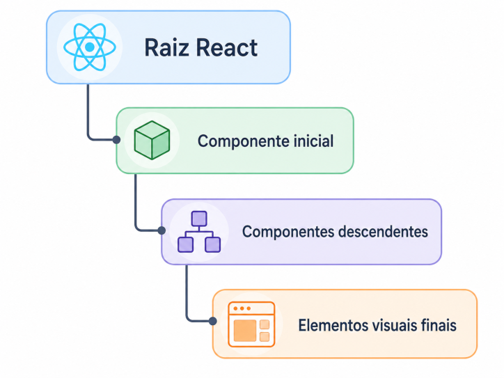

## Árvore de componentes

A **árvore de componentes** é a estrutura hierárquica formada pela composição entre componentes React. Nesse modelo, um componente pode conter outros componentes, que por sua vez podem conter novos componentes, formando uma organização em níveis.

A documentação oficial do React descreve que aplicações React são construídas a partir de componentes, e que esses componentes podem ser combinados para formar interfaces completas. ([react.dev](https://react.dev/learn/your-first-component))

Uma árvore de componentes pode ser representada assim:


Nessa representação, `App` é o componente de nível superior. Ele contém `Header`, `MainContent` e `Footer`. O componente `MainContent` contém `ProductList` e `CartSummary`. O componente `ProductList`, por sua vez, contém componentes `ProductCard`.

A árvore indica uma relação de composição, não uma relação de herança. Um componente não “herda” automaticamente o comportamento de outro. Ele é renderizado dentro da estrutura retornada por outro componente.

Exemplo simplificado:

```tsx
function Header() {
  return <header>Aplicação</header>;
}

function ProductCard() {
  return <article>Produto</article>;
}

function ProductList() {
  return (
    <section>
      <ProductCard />
      <ProductCard />
    </section>
  );
}

function App() {
  return (
    <main>
      <Header />
      <ProductList />
    </main>
  );
}
```

A estrutura acima forma a seguinte árvore:


Componentes de nível superior costumam organizar regiões maiores da interface. Componentes intermediários agrupam seções e listas. Componentes internos representam partes mais específicas da tela.

A árvore de componentes é importante porque a renderização ocorre a partir de uma raiz. A raiz React recebe uma estrutura inicial, e a partir dela os componentes descendentes são avaliados e renderizados.



## Renderização da interface

A **renderização da interface** é o processo pelo qual o React interpreta a estrutura declarada pelos componentes e coordena sua exibição no navegador. Em uma aplicação React, os componentes descrevem o que deve aparecer na tela, e o React organiza a atualização da interface quando dados, propriedades, estado ou rotas mudam.

A documentação oficial do React descreve a renderização como parte de um fluxo composto por três momentos: disparo da renderização, renderização dos componentes e confirmação das alterações no DOM. Esse fluxo é apresentado como **trigger**, **render** e **commit**. ([react.dev](https://react.dev/learn/render-and-commit))

Na renderização inicial, o disparo ocorre quando a aplicação chama `root.render(...)`. Nas renderizações posteriores, o disparo pode ocorrer por mudança de estado, alteração de propriedades, atualização de dados ou mudança de rota.

Um componente simples pode ser representado assim:

```tsx
function Message() {
  return <p>Pedido recebido.</p>;
}
```

Ao renderizar esse componente, o React interpreta o retorno JSX e produz a estrutura correspondente na interface do navegador.

A renderização também pode depender de dados recebidos pelo componente:

```tsx
type CartMessageProps = {
  itemsCount: number;
};

function CartMessage({ itemsCount }: CartMessageProps) {
  return <p>Itens no carrinho: {itemsCount}</p>;
}
```

Nesse exemplo, a interface renderizada depende do valor de `itemsCount`. Se esse valor mudar, o React pode atualizar a parte correspondente da interface.

A renderização em React é declarativa. O componente não precisa informar passo a passo como alterar cada elemento do DOM. Ele descreve a estrutura esperada, e o React determina como refletir essa descrição na interface.

Exemplo declarativo:

```tsx
function StatusLabel({ completed }: { completed: boolean }) {
  return (
    <span>
      {completed ? "Concluído" : "Pendente"}
    </span>
  );
}
```

Nesse exemplo, o componente descreve o texto esperado conforme o valor de `completed`. O React é responsável por atualizar a interface quando esse valor muda.

Em uma aplicação organizada como árvore de componentes, a renderização não ocorre apenas em um componente isolado. O React percorre a estrutura a partir da raiz renderizada e avalia os componentes necessários para produzir a interface.

A renderização da interface deve ser compreendida como o mecanismo que transforma componentes, propriedades e estados em uma interface visível e atualizável no navegador.

## React DOM

O **React DOM** é o pacote responsável por conectar a interface descrita pelos componentes React ao **DOM do navegador**. Enquanto o React organiza a interface em componentes e coordena sua renderização, o React DOM fornece as APIs que permitem inserir essa interface em um elemento HTML real.

A documentação oficial apresenta as APIs de cliente do `react-dom/client`, entre elas `createRoot`, usada para criar uma raiz React dentro de um nó DOM do navegador. Essa raiz permite renderizar componentes React no documento HTML. ([react.dev](https://react.dev/reference/react-dom/client))

Essa distinção é necessária porque o React, isoladamente, não define onde a interface será exibida. A estrutura descrita pelos componentes precisa ser associada a um elemento existente no HTML. Essa associação é realizada pelo React DOM.

Em projetos React atuais, essa integração normalmente ocorre por meio da importação de `createRoot` a partir de `react-dom/client`:

```tsx
import { createRoot } from "react-dom/client";
```

O React DOM atua na fronteira entre a estrutura declarativa dos componentes React e o documento HTML interpretado pelo navegador. Ele não substitui o React; fornece o mecanismo necessário para que a interface construída com React seja montada e atualizada no DOM.

## Elemento `root` no HTML

O elemento **`root`** é o ponto de referência definido no HTML para receber a aplicação React. Em projetos criados com Vite, esse elemento normalmente aparece no arquivo `index.html` como uma `div` vazia com o identificador `root`.

```html
<div id="root"></div>
```

Esse elemento não representa uma tela da aplicação e não contém, inicialmente, os componentes React. Sua função é indicar o local do documento HTML em que a aplicação será inserida posteriormente pelo código de inicialização.

No mesmo arquivo `index.html`, também aparece o carregamento do arquivo principal da aplicação:

```html
<script type="module" src="/src/main.tsx"></script>
```

O atributo `id="root"` permite que esse elemento seja localizado pelo código JavaScript/TypeScript:

```tsx
const rootElement = document.getElementById("root");
```

A relação entre os dois trechos deve ser coerente:

```html
<div id="root"></div>
```

```tsx
document.getElementById("root");
```

O valor `"root"` usado no HTML deve ser o mesmo valor usado na chamada de `document.getElementById`. Se o identificador no HTML for alterado, o código de inicialização também precisa ser alterado.

O nome `root` é uma convenção, não uma exigência da linguagem HTML ou do React. O projeto poderia usar outro identificador, como `app`, desde que o mesmo nome fosse usado nos dois pontos.

```html
<div id="app"></div>
```

```tsx
const rootElement = document.getElementById("app");
```

A documentação oficial do React informa que a criação de uma raiz React ocorre sobre um **nó DOM do navegador**. Esse nó DOM é justamente o elemento HTML previamente definido para receber a aplicação. ([react.dev](https://react.dev/reference/react-dom/client/createRoot))

O elemento `root` estabelece a referência inicial entre o HTML estático e o código React carregado a partir do arquivo de entrada da aplicação.

## Montagem da aplicação React

A **montagem da aplicação React** corresponde ao processo de inicialização da interface no navegador. Nessa etapa, o código React é associado a um elemento HTML previamente existente e passa a controlar a renderização da interface dentro desse ponto de montagem.

A montagem ocorre no arquivo de entrada da aplicação, normalmente o `main.tsx`. Esse arquivo localiza o elemento HTML definido no `index.html`, cria uma raiz React sobre esse elemento e renderiza a estrutura inicial da aplicação.

Em termos de código, a montagem pode ser representada de forma simplificada assim:

```tsx
const rootElement = document.getElementById("root");

if (!rootElement) {
  throw new Error("Elemento root não encontrado");
}

createRoot(rootElement).render(
  <StrictMode>
    <App />
  </StrictMode>
);
```

A primeira instrução localiza o elemento HTML que receberá a aplicação:

```tsx
const rootElement = document.getElementById("root");
```

Essa etapa apenas recupera a referência ao elemento do DOM. A existência e a função do elemento `root` foram tratadas no subtítulo anterior.

Em seguida, ocorre a validação da referência obtida:

```tsx
if (!rootElement) {
  throw new Error("Elemento root não encontrado");
}
```

Essa verificação é necessária porque `document.getElementById` pode retornar `null` quando não encontra o elemento solicitado. Em TypeScript, esse comportamento precisa ser considerado, pois a montagem da aplicação depende de um elemento válido.

Depois da validação, o elemento é entregue ao React DOM:

```tsx
createRoot(rootElement)
```

Nesse ponto, o React DOM cria uma raiz React associada ao elemento HTML. A partir dessa raiz, o React passa a controlar a renderização da interface naquele ponto do documento.

Por fim, a estrutura inicial da aplicação é renderizada:

```tsx
.render(
  <StrictMode>
    <App />
  </StrictMode>
);
```

O método `render` recebe a estrutura React que será exibida inicialmente. No exemplo, essa estrutura é composta pelo componente principal `App`, envolvido por `StrictMode`.

A documentação oficial informa que `createRoot` cria uma raiz React para exibir componentes dentro de um nó DOM do navegador e que, depois da criação da raiz, o método `root.render` deve ser usado para exibir um componente React dentro dela. ([react.dev](https://react.dev/reference/react-dom/client/createRoot))

A montagem da aplicação pode ser sintetizada assim:

A montagem não define o conteúdo específico das telas. Ela estabelece o vínculo técnico inicial entre o HTML, o React DOM e a árvore de componentes que será exibida pela aplicação.


## `main.tsx`

O arquivo **`main.tsx`** é o ponto de entrada da aplicação React. Ele é carregado a partir do `index.html` e concentra a inicialização da aplicação no navegador.

Em projetos criados com Vite, o `index.html` normalmente carrega o `main.tsx` por meio de um script do tipo módulo:

```html
<script type="module" src="/src/main.tsx"></script>
```

Esse script informa ao navegador que o arquivo `/src/main.tsx` deve ser carregado como módulo JavaScript. A partir desse arquivo, a aplicação React passa a ser inicializada.

Uma estrutura típica de `main.tsx` pode ser representada assim:

```tsx
import { StrictMode } from "react";
import { createRoot } from "react-dom/client";

import "./index.css";
import { App } from "./App";

const rootElement = document.getElementById("root");

if (!rootElement) {
  throw new Error("Elemento root não encontrado");
}

createRoot(rootElement).render(
  <StrictMode>
    <App />
  </StrictMode>
);
```

A primeira parte reúne as importações necessárias para a inicialização:

```tsx
import { StrictMode } from "react";
import { createRoot } from "react-dom/client";

import "./index.css";
import { App } from "./App";
```

A importação de `StrictMode` vem da biblioteca React. Esse recurso será tratado em subtítulo próprio, pois sua função está relacionada às verificações realizadas em ambiente de desenvolvimento.

A importação de `createRoot` vem de `react-dom/client`. Esse recurso será detalhado no próximo subtítulo, pois ele é responsável por criar a raiz React no elemento HTML de montagem.

A importação de `./index.css` carrega o CSS global da aplicação. Essa importação será tratada em subtítulo próprio, pois se relaciona à aplicação de estilos globais no projeto.

A importação de `App` representa a estrutura inicial que será renderizada. Em projetos com roteamento, esse ponto pode ser substituído ou envolvido por provedores, como provedores de rotas ou de estado global.

A segunda parte localiza o elemento de montagem no documento HTML:

```tsx
const rootElement = document.getElementById("root");
```

Esse trecho estabelece a ligação entre o elemento `root`, definido no `index.html`, e o código de inicialização da aplicação.

A terceira parte valida a existência do elemento:

```tsx
if (!rootElement) {
  throw new Error("Elemento root não encontrado");
}
```

Essa validação é necessária porque `document.getElementById` pode retornar `null` caso o elemento não exista no documento. A verificação impede que a aplicação tente criar uma raiz React sobre uma referência inexistente.

A quarta parte realiza a montagem da aplicação:

```tsx
createRoot(rootElement).render(
  <StrictMode>
    <App />
  </StrictMode>
);
```

Nesse trecho, o elemento HTML validado é entregue ao React DOM, e a estrutura inicial da aplicação é renderizada. A explicação detalhada de `createRoot`, `render` e `StrictMode` será feita nos subtítulos seguintes.

A estrutura funcional do `main.tsx` pode ser sintetizada assim:

```txt
main.tsx
├── importa recursos de inicialização
├── importa o CSS global
├── importa a estrutura inicial da aplicação
├── localiza o elemento de montagem
├── valida a existência desse elemento
└── inicia a renderização da aplicação
```

O `main.tsx` não representa uma tela da aplicação. Sua função é iniciar a aplicação React, conectando o documento HTML, o React DOM, o CSS global e a estrutura principal que será renderizada no navegador.

## Importação do CSS global

A **importação do CSS global** corresponde ao carregamento do arquivo de estilos que define regras visuais aplicáveis à aplicação como um todo. Em projetos React com Vite, essa importação normalmente ocorre no arquivo de entrada da aplicação, como o `main.tsx`.

No arquivo `main.tsx`, a importação aparece da seguinte forma:

```tsx
import "./index.css";
```

Esse comando não importa uma função, uma constante ou um componente. Ele importa um arquivo CSS para que suas regras sejam processadas pelo ambiente de desenvolvimento e aplicadas à interface renderizada no navegador.

A documentação oficial do Vite informa que arquivos CSS podem ser importados diretamente a partir de arquivos JavaScript. O conteúdo importado é inserido na página e também participa do processo de atualização durante o desenvolvimento. ([vite.dev](https://vite.dev/guide/features.html#css))

O arquivo `index.css` é chamado de global porque suas regras podem afetar elementos, classes e estruturas presentes em diferentes partes da aplicação. Regras aplicadas ao `body`, a links, botões, classes utilitárias ou variáveis CSS ficam disponíveis para toda a interface.

Exemplo simplificado:

```css
body {
  margin: 0;
  font-family: system-ui, sans-serif;
}

button {
  font: inherit;
}
```

Essas regras não pertencem a um componente específico. Elas definem comportamentos visuais gerais da aplicação.

A importação no `main.tsx` garante que o CSS global seja carregado desde o início da aplicação, antes da renderização visual das telas. Como o `main.tsx` é o ponto de entrada do projeto, todo estilo importado nesse arquivo passa a fazer parte da base visual comum da aplicação.

A importação do CSS global não renderiza conteúdo na tela. Ela apenas disponibiliza regras visuais que serão aplicadas aos elementos renderizados pelos componentes React.


## `createRoot`

A função **`createRoot`** pertence ao pacote `react-dom/client` e é utilizada para criar uma **raiz React** em um elemento do DOM do navegador. Essa raiz é o ponto a partir do qual o React passa a controlar a renderização da interface dentro de um elemento HTML existente.

A documentação oficial define `createRoot` como a API usada para criar uma raiz React para exibir componentes dentro de um nó DOM do navegador. Depois da criação dessa raiz, utiliza-se o método `render` para exibir a estrutura React desejada. ([react.dev](https://react.dev/reference/react-dom/client/createRoot))

A importação é feita da seguinte forma:

```tsx
import { createRoot } from "react-dom/client";
```

O uso básico segue esta estrutura:

```tsx
const rootElement = document.getElementById("root");

if (!rootElement) {
  throw new Error("Elemento root não encontrado");
}

createRoot(rootElement);
```

O argumento recebido por `createRoot` deve ser um elemento real do DOM. No exemplo, esse elemento é obtido por meio de:

```tsx
const rootElement = document.getElementById("root");
```

Essa instrução localiza no `index.html` o elemento com `id="root"`:

```html
<div id="root"></div>
```

A validação do elemento é necessária porque `document.getElementById("root")` pode retornar `null`. Em TypeScript, esse comportamento precisa ser tratado antes da chamada de `createRoot`.

```tsx
if (!rootElement) {
  throw new Error("Elemento root não encontrado");
}
```

Sem essa verificação, haveria o risco de passar um valor nulo para uma função que espera um elemento DOM válido. A validação torna explícita a dependência entre o HTML e o código de inicialização.

A função `createRoot` não renderiza a interface por si só. Ela apenas cria a raiz React. A renderização ocorre em seguida, por meio do método `render`.

```tsx
createRoot(rootElement).render(
  <StrictMode>
    <App />
  </StrictMode>
);
```

Também é possível escrever o mesmo processo em duas etapas:

```tsx
const root = createRoot(rootElement);

root.render(
  <StrictMode>
    <App />
  </StrictMode>
);
```

Essa forma evidencia melhor que `createRoot` produz um objeto de raiz, e que esse objeto possui o método `render`.

A raiz React representa o vínculo entre o DOM do navegador e a árvore de componentes da aplicação. A partir dela, o React consegue gerenciar a renderização da interface, atualizar os componentes quando necessário e manter a correspondência entre a estrutura React e o conteúdo exibido no navegador.

Em versões atuais do React, `createRoot` substitui o padrão antigo baseado em `ReactDOM.render`, utilizado em versões anteriores. O uso de `createRoot` está associado ao modelo moderno de criação de raiz introduzido no React 18 e mantido nas versões atuais da documentação oficial.
