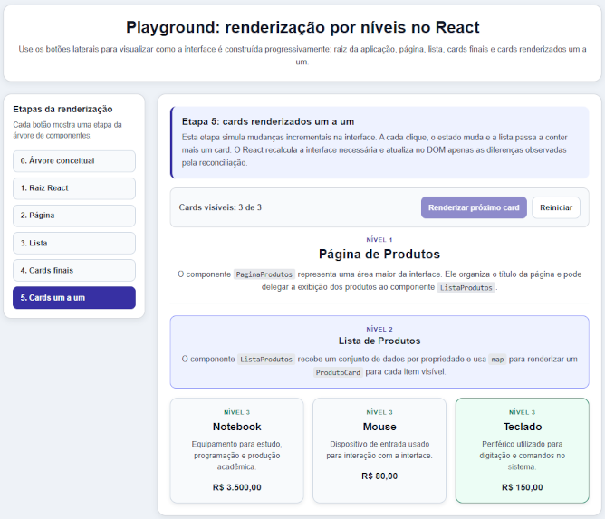

## Estudo guiado: renderização por níveis no React

Este estudo guiado tem como objetivo demonstrar como uma interface React pode ser organizada como uma árvore de componentes e renderizada progressivamente no navegador. O exemplo retoma os conceitos de componente, composição, props, retorno JSX, `main.tsx`, `createRoot`, `render` e árvore de componentes.

Alguns recursos aparecem apenas como apoio ao exemplo, como estado local, dados simulados e organização de estilos. Esses recursos serão retomados em capítulos posteriores. Neste momento, o foco está em compreender como os componentes se organizam e como a interface é montada a partir dessa organização.


## Playground: renderização por níveis no React

A tela apresentada corresponde a um playground didático construído para demonstrar como uma interface React pode ser organizada e renderizada por níveis. O objetivo da aplicação não é simular um sistema completo de produtos, mas tornar visível a estrutura interna de uma interface baseada em componentes.

Na parte superior da tela, há o título da atividade e uma breve descrição do funcionamento do playground. Essa área apresenta o propósito da demonstração: visualizar como a interface é construída progressivamente, desde a raiz da aplicação até os elementos visuais finais.

Na lateral esquerda, encontra-se o painel **Etapas da renderização**. Cada botão representa uma etapa da construção da interface. A navegação por essas etapas permite observar a progressão da árvore de componentes. A etapa inicial apresenta a árvore conceitual. Em seguida, aparecem a raiz React, a página, a lista, os cards finais e, por fim, a renderização dos cards um a um.

A área principal da tela exibe o conteúdo correspondente à etapa selecionada. No exemplo apresentado, a etapa ativa é **“Cards renderizados um a um”**. Essa etapa mostra que a interface pode ser atualizada progressivamente conforme o estado da aplicação muda. Cada clique no botão **“Renderizar próximo card”** altera o estado interno do componente e faz com que mais um card seja exibido na lista.

A seção **Página de Produtos** representa um nível superior da interface. Ela corresponde a uma área maior da aplicação, responsável por organizar o conteúdo da página e delegar parte da renderização para componentes internos.

A seção **Lista de Produtos** representa um segundo nível da árvore. Sua função é receber um conjunto de dados e produzir a renderização dos cards. Nesse ponto, aparece a relação entre dados, propriedades e composição de componentes.

Os cards de produto representam o nível mais interno da interface. Cada card exibe os dados de um produto específico, como nome, descrição e preço. Assim, cada ocorrência visual de card corresponde a uma instância do componente `ProdutoCard`.

A tela permite observar a seguinte estrutura conceitual:

```text
App
└── PaginaProdutos
    └── ListaProdutos
        ├── ProdutoCard
        ├── ProdutoCard
        └── ProdutoCard
```



### Criar o projeto, entrar na pasta, instalar se necessário e executar o projeto

```bash
npm create vite@latest sample-render -- --template react-ts
cd sample-render
npm install
npm run dev
```

### Limpar a estrutura inicial

Remover ou simplificar os arquivos iniciais do Vite, principalmente:

```text
src/App.tsx
src/App.css
src/index.css
```

