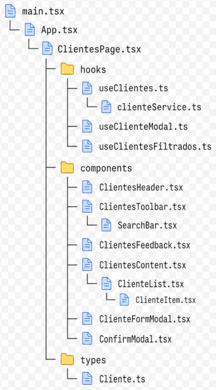

## Arquitetura

A arquitetura do projeto foi organizada em camadas com responsabilidades distintas. Essa organização permite compreender a aplicação como um conjunto de partes articuladas, no qual cada arquivo possui uma função delimitada dentro do fluxo geral de execução.

A base mais profunda do projeto está em `types`. O arquivo `Cliente.ts` define a estrutura dos dados utilizados pela aplicação. Ele estabelece o formato do cliente completo e dos dados manipulados pelo formulário. Essa camada não executa lógica e não renderiza interface; sua função é definir contratos de tipagem para orientar os demais arquivos.

A camada seguinte está em `services`. O arquivo `clienteService.ts` concentra a comunicação com a API. Nele são definidas as funções de listar, cadastrar, atualizar e excluir clientes. Essa camada também não controla tela e não mantém estado. Sua responsabilidade é tratar a comunicação externa com o recurso `clientes`.

Acima do serviço estão os `hooks`. O hook `useClientes` controla os dados da aplicação, incluindo lista de clientes, carregamento, erro e operações de persistência. O hook `useClienteModal` controla a abertura e fechamento do modal de formulário, além do cliente selecionado. O hook `useClientesFiltrados` calcula a lista derivada a partir do valor da busca. Dessa forma, a lógica de estado e derivação é retirada da página e distribuída em funções especializadas.

A camada de componentes concentra a construção visual da interface. Componentes como `SearchBar`, `ClienteList`, `ClienteItem`, `ClienteFormModal`, `ConfirmModal`, `ClientesHeader`, `ClientesToolbar`, `ClientesFeedback` e `ClientesContent` possuem responsabilidades específicas. Alguns são componentes reutilizáveis, como `SearchBar` e `ConfirmModal`; outros são componentes diretamente associados à página de clientes, como `ClientesHeader` e `ClientesContent`.

A página `ClientesPage.tsx` atua como coordenadora. Ela conecta os hooks aos componentes, define o fluxo de cadastro, edição, busca e exclusão, e decide quando os modais devem ser exibidos. A página não acessa diretamente a API, não contém a estrutura interna dos componentes menores e não concentra a estilização visual. Sua função é articular as partes do sistema.

O arquivo `App.tsx` atua como componente de composição inicial. Ele renderiza a página de clientes dentro do elemento principal da aplicação. Sua responsabilidade é reduzida, pois não controla estado, não executa regras de negócio e não conhece os detalhes internos da tela.

O arquivo `main.tsx` é o ponto de entrada. Ele conecta a aplicação React ao elemento `#root` do HTML, carrega os estilos globais e renderiza o componente `App` dentro do `StrictMode`.

Assim, o fluxo arquitetural pode ser compreendido da seguinte forma:

```txt
types
→ services
→ hooks
→ components
→ ClientesPage
→ App
→ main
```

Essa sequência indica a dependência conceitual do projeto. Os tipos sustentam a estrutura dos dados. Os serviços acessam a API. Os hooks organizam estado e lógica. Os componentes constroem a interface. A página coordena a interação. O `App` compõe a aplicação. O `main` inicializa a execução.

Dessa forma, o projeto apresenta uma arquitetura modular, com separação entre dados, comunicação externa, estado, interface e inicialização. Essa organização reduz acoplamento, facilita manutenção e torna mais clara a função de cada parte do código.

## Árvore conceitual das responsabilidades do projeto

A árvore conceitual de responsabilidades representa a aplicação a partir da relação entre suas partes. Essa representação não descreve apenas a ordem dos arquivos, mas a função que cada camada exerce no funcionamento geral do sistema.

A base da árvore está na definição dos dados. O arquivo `Cliente.ts`, localizado em `types`, estabelece a estrutura dos objetos utilizados pela aplicação. A partir dele, os demais arquivos passam a operar com uma representação comum de cliente e de dados de formulário.

Essa camada não executa operações, não acessa API e não renderiza elementos visuais. Sua função é definir a forma dos dados. Portanto, ela sustenta a aplicação no nível conceitual e tipado.

Acima da tipagem está a camada de serviço. O arquivo `clienteService.ts` concentra o acesso à API.

Essa camada transforma operações do sistema em requisições HTTP. Listar, cadastrar, atualizar e excluir clientes são ações realizadas nesse ponto. O serviço não controla estado e não conhece a interface. Ele apenas estabelece a comunicação externa com `http://localhost:3000/clientes`.

A camada seguinte é formada pelos hooks.

O hook `useClientes.ts` controla os dados, o carregamento, as mensagens de erro e as operações de persistência. O hook `useClienteModal.ts` controla a abertura do modal de formulário e o cliente selecionado. O hook `useClientesFiltrados.ts` calcula a lista derivada a partir da busca. Assim, os hooks concentram lógica e estado, evitando que a página assuma todas essas responsabilidades diretamente.

A próxima camada é formada pelos componentes visuais.

Esses componentes representam partes específicas da interface. Alguns são mais genéricos, como `ConfirmModal`, que pode ser usado em diferentes confirmações do sistema. Outros são vinculados diretamente à página de clientes, como `ClientesHeader`, `ClientesToolbar`, `ClientesFeedback` e `ClientesContent`. Em todos os casos, a regra central é manter a responsabilidade delimitada: cada componente recebe dados e funções por `props` e executa apenas a parte visual ou interativa que lhe pertence.

A página `ClientesPage.tsx` ocupa o ponto de coordenação da árvore.


Essa página conecta as camadas inferiores. Ela usa os hooks, passa dados para os componentes, recebe eventos da interface e decide quando abrir o formulário ou o modal de confirmação. A página não executa diretamente `fetch`, não define o visual interno dos componentes e não contém a regra de filtragem detalhada. Sua função é articular o fluxo da tela.

Acima da página está o componente principal da aplicação.


O `App.tsx` atua como ponto de composição. Ele renderiza `ClientesPage` dentro do elemento principal da aplicação. Sua responsabilidade é reduzida porque a lógica da tela foi deslocada para a página e seus respectivos hooks e componentes.

No topo da execução está o arquivo de inicialização.

O `main.tsx` conecta o React ao elemento `#root` do HTML, carrega os estilos globais e renderiza o componente `App`. Ele é o ponto inicial da execução, mas não participa das regras de negócio da aplicação.

A árvore conceitual pode ser sintetizada da seguinte forma:



Essa árvore evidencia a direção das responsabilidades. A execução inicia em `main.tsx`, passa por `App.tsx`, chega à página e, a partir dela, aciona hooks, serviços e componentes. Conceitualmente, porém, a compreensão do projeto parte da base: primeiro os tipos, depois os serviços, em seguida os hooks, os componentes, a página, o `App` e, por fim, o ponto de entrada.

Dessa forma, o projeto apresenta uma estrutura modular, na qual cada parte possui uma função definida. A aplicação deixa de depender de um único componente centralizador e passa a ser organizada por camadas: dados, comunicação, estado, interface, coordenação e inicialização.
